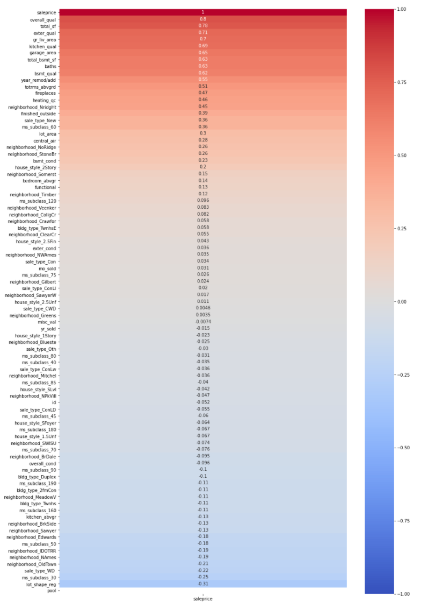
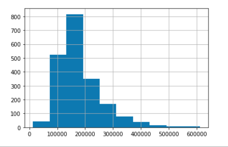
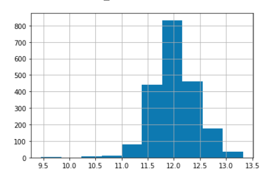
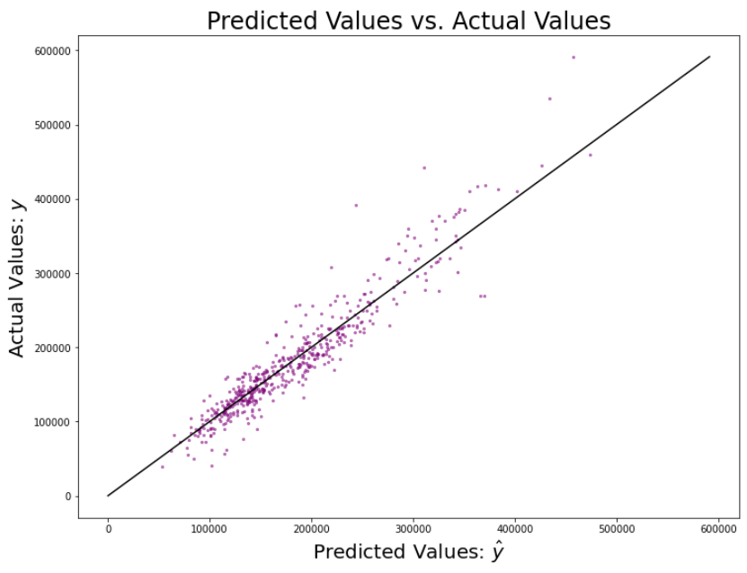

# Ames Housing Modeling
## Justin Fischer
### GA-DSI-11-DEN Project 2
---
# Executive Summary

Given the data from home sales in Ames, Iowa between 2006 - 2010, can we predict prices for more home sales?  Starting with over 2,000 home sales with 80+ different features (most are described [here](http://jse.amstat.org/v19n3/decock/DataDocumentation.txt)).  I ran a number of different regression models using a number of different sets of features and adjusting the values.  The closest I came was within about $23,000 of the actual price.  This is about 13% of the average price of home sales ($181,000).  This shows that I am getting closer to an accurate model but here is a number of outside factors that will need to be added into the model as well.

# Report

Starting with two datasets, a training set and a testing set (no sale price).  I then went through and cleaned up the data, removing some features that were blank.  Then had to create a number of new features.  This involved converting many of the quality columns to numbers so they could be used in the model.  Additionally, I created dummy variables for other descriptors, such as neighborhood and house type.  Some of the empty data for areas in homes that don't have a feature, I set to zero (such as basement area).  Finally, I combined a number of the columns into one piece of data (combined all the bathrooms together and others).

## Data
|Feature|Type|Dataset/Created|Description|
|--|--|--|--|
|**'lot_area',**|*float*|dataset|Size of property|
|**'overall_qual',**|*integer*|dataset|Overall quality|
|**'overall_cond',**|*Integer*|dataset|Overall condition|
|**'year_remod/add',**|*Integer*|dataset|Year remodeled/added on/built|
|**'exter_qual',**|*Integer*|converted|Exterior finish quality|
|**'exter_cond',**|*Integer*|converted|Exterior condition|
|**'bsmt_qual',**|*Integer*|converted|Basement quality|
|**'bsmt_cond',**|*Integer*|converted|Basement condition|
|**'total_bsmt_sf',**|*Integer*|converted|Basement size|
|**'heating_qc',**|*Integer*|converted|Heating quality|
|**'central_air',**|*Integer*|converted|Has air conditioning|
|**'gr_liv_area',**|*Integer*|dataset|Space above ground|
|**'bedroom_abvgr',**|*Integer*|dataset|Bedrooms above ground|
|**'kitchen_abvgr',**|*Integer*|dataset|Kitchens above ground|
|**'kitchen_qual',**|*Integer*|converted|Kitchen quality|
|**'totrms_abvgrd',**|*Integer*|dataset|Total rooms above ground without bathrooms|
|**'functional',**|*Integer*|converted|Condition of the property (Salvage to Normal)|
|**'fireplaces',**|*Integer*|dataset|Number fireplaces|
|**'garage_area',**|*Integer*|dataset|Size of garage|
|**'misc_val',**|*Integer*|dataset|Miscaleneous value (such as elevators, etc)|
|**'mo_sold',**|*Integer*|dataset|Month sold|
|**'yr_sold',**|*Integer*|dataset|Year sold|
|**'saleprice',**|*Integer*|dataset|Sale Price, target value|
|**'total_sf',**|*Integer*|created|Total size (above ground + basement)|
|**'finished_outside',**|*Integer*|created|Square footage of porches and decks|
|**'ms_subclass_30',**|*Integer*|dummy|1-STORY 1945 & OLDER|
|**'ms_subclass_40',**|*Integer*|dummy|1-STORY W/FINISHED ATTIC ALL AGES|
|**'ms_subclass_45',**|*Integer*|dummy|1-1/2 STORY - UNFINISHED ALL AGES|
|**'ms_subclass_50',**|*Integer*|dummy|1-1/2 STORY FINISHED ALL AGES|
|**'ms_subclass_60',**|*Integer*|dummy|2-STORY 1946 & NEWER|
|**'ms_subclass_70',**|*Integer*|dummy|2-STORY 1945 & OLDER|
|**'ms_subclass_75',**|*Integer*|dummy|2-1/2 STORY ALL AGES|
|**'ms_subclass_80',**|*Integer*|dummy|SPLIT OR MULTI-LEVEL|
|**'ms_subclass_85',**|*Integer*|dummy|SPLIT FOYER|
|**'ms_subclass_90',**|*Integer*|dummy|DUPLEX - ALL STYLES AND AGES|
|**'ms_subclass_120',**|*Integer*|dummy|1-STORY PUD (Planned Unit Development) - 1946 & NEWER|
|**'ms_subclass_150',**|*Integer*|dummy|1-1/2 STORY PUD - ALL AGES|
|**'ms_subclass_160',**|*Integer*|dummy|2-STORY PUD - 1946 & NEWER|
|**'ms_subclass_180',**|*Integer*|dummy|PUD - MULTILEVEL - INCL SPLIT LEV/FOYER|
|**'ms_subclass_190',**|*Integer*|dummy|2 FAMILY CONVERSION - ALL STYLES AND AGES|
|**'neighborhood_Blueste',**|*Integer*|dummy|Bluestem|
|**'neighborhood_BrDale',**|*Integer*|dummy|Briardale|
|**'neighborhood_BrkSide',**|*Integer*|dummy|Brookside|
|**'neighborhood_ClearCr',**|*Integer*|dummy|Clear Creek|
|**'neighborhood_CollgCr',**|*Integer*|dummy|College Creek|
|**'neighborhood_Crawfor',**|*Integer*|dummy|Crawford|
|**'neighborhood_Edwards',**|*Integer*|dummy|Edwards|
|**'neighborhood_Gilbert',**|*Integer*|dummy|Gilbert|
|**'neighborhood_Greens',**|*Integer*|dummy|Greens|
|**'neighborhood_GrnHill',**|*Integer*|dummy|Green Hills|
|**'neighborhood_IDOTRR',**|*Integer*|dummy|Iowa DOT and Rail Road|
|**'neighborhood_Landmrk',**|*Integer*|dummy|Landmark|
|**'neighborhood_MeadowV',**|*Integer*|dummy|Meadow Village|
|**'neighborhood_Mitchel',**|*Integer*|dummy|Mitchell|
|**'neighborhood_NAmes',**|*Integer*|dummy|North Ames|
|**'neighborhood_NoRidge',**|*Integer*|dummy|Northridge|
|**'neighborhood_NPkVill',**|*Integer*|dummy|Northpark Villa|
|**'neighborhood_NridgHt',**|*Integer*|dummy|Northridge Heights|
|**'neighborhood_NWAmes',**|*Integer*|dummy|Northwest Ames|
|**'neighborhood_OldTown',**|*Integer*|dummy|Old Town|
|**'neighborhood_Sawyer',**|*Integer*|dummy|Sawyer|
|**'neighborhood_SawyerW',**|*Integer*|dummy|Sawyer West|
|**'neighborhood_Somerst',**|*Integer*|dummy|Somerset|
|**'neighborhood_StoneBr',**|*Integer*|dummy|Stone Brook|
|**'neighborhood_SWISU',**|*Integer*|dummy|South & West of Iowa State University|
|**'neighborhood_Timber',**|*Integer*|dummy|Timberland|
|**'neighborhood_Veenker',**|*Integer*|dummy|Veenker|
|**'bldg_type_2fmCon',**|*Integer*|dummy|Two-family Conversion; originally built as one-family dwelling|
|**'bldg_type_Duplex',**|*Integer*|dummy|Duplex|
|**'bldg_type_Twnhs',**|*Integer*|dummy|Townhouse Inside Unit|
|**'bldg_type_TwnhsE',**|*Integer*|dummy|Townhouse End Unit|
|**'house_style_1.5Unf',**|*Integer*|dummy|One and one-half story: 2nd level unfinished|
|**'house_style_1Story',**|*Integer*|dummy|One story|
|**'house_style_2.5Fin',**|*Integer*|dummy|Two and one-half story: 2nd level finished|
|**'house_style_2.5Unf',**|*Integer*|dummy|Two and one-half story: 2nd level unfinished|
|**'house_style_2Story',**|*Integer*|dummy|Two story|
|**'house_style_SFoyer',**|*Integer*|dummy|Split Foyer|
|**'house_style_SLvl',**|*Integer*|dummy|Split Level|
|**'sale_type_CWD',**|*Integer*|dummy|Warranty Deed - Cash|
|**'sale_type_Con',**|*Integer*|dummy|Contract 15% Down payment regular terms|
|**'sale_type_ConLD',**|*Integer*|dummy|Contract Low Down|
|**'sale_type_ConLI',**|*Integer*|dummy|Contract Low Interest|
|**'sale_type_ConLw',**|*Integer*|dummy|Contract Low Down payment and low interest|
|**'sale_type_New',**|*Integer*|dummy|Home just constructed and sold|
|**'sale_type_Oth',**|*Integer*|dummy|Other|
|**'sale_type_WD',**|*Integer*|dummy|Warranty Deed - Conventional|
|**'lot_shape_reg',**|*Integer*|converted|Lot shape (regular v irregular)|
|**'baths',**|*Integer*|created|Total number of baths (full + half)|
|**'pool',**|*Integer*|converted|Has pool|

## Modeling
One of the first steps after estabilishing the subset of data was to run a correlation heatmap against sale price.  This is just to get a initial quick look at what might be the most correlated features.

Furthermore, after looking after the initial results, the distribution of sale price is not normal.  By scaling the price using the natural log, it was able to create a normal distribution.  This makes modeling and predictions more accurate.  
### Price Distribution

### Log Price Distribution

Each model was scored on the square root of the mean squared error.  This means that we started with the difference between the predicted sale price and the actual sale price.  This was then squared to eliminate all negatives and averaged.  Finally it is square rooted to undo the squaring.  

|Model|RMSE|Percent of Mean|Features|
|--|--|--|--|
|Simple|44598|25.58%|Total rooms, total square feet|
|Select Features|31117|17.15%|See note|
|Select Features - log|28640|15.78%|Select feature with log of the sale price|
|Ridge|36240|19.97%|Used the ridge function to get better fit with select features|
|Ridge - log|28252|15.57%|Same as above but log of the sale price|
|Neighborhood|28252|15.57%|Select features + Neighborhood|
|Class|25638|14.13%|Select features + Class|
|Style|25691|14.16%|Select features + Style|
|Class+Neighborhood|24505|13.50%|Select features + Neighborhood + Class|
|All Features|23732|13.08%|All features from table above|
|Sale Type|28258|15.57%|Select features + Sale type|

 *Note: **Select features**: Total square feet, Overall quality, Exterior quality, above ground area, kitchen quality, basement quality, garage area, number of bathrooms, total basement square feet, year remodeled/added on/built, total rooms above ground, size of the lot, functional use of the house*

### Error mapping

When looking at the errors, we need to only focus on one direction.  A predicted price that is lower than the actual price is fine since an investment made on that prediction should still have a positive return.  However, when the predicted price is too high, it can cause issues in the portfolio when we try to sell it and can't get back the initial investment.  Ideally, each datapoint would be above the line where predictions and actuals are the same.

# Conclusions and Next Steps

The lowest error size was about 13%.  This is a little higher than we would prefer to make investment descisions off of, especially if there is any work to do on the house before the sale.  There is some additional data that could be useful here to tune the model including the state of the economy, the size of the market and how much is on the market currently as well as the trends of people moving in and out of the region.  Using the data from this time period is also hard to use because of the financial crisis in 2008.  Not only did the markets crash and interest rates dropped, but mortgage lending was changed.  That makes this data hard to base a model off of going forward.  Finally, more data on the demographics on the region and needs of the people.  This will help really tune neighborhoods and want people want.  Knowing this the model can be finely tuned and most adjustable to current times.  
